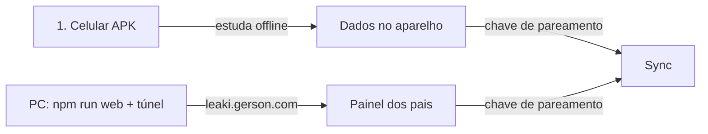

# Passo a Passo: Criar no Computador e Estudar no Celular (Leaki)

Este guia ensina como usar o **Leaki** no computador e no celular Android, incluindo a criação de fichas, gravação de áudios, avaliação de leitura por voz com IA, exportação/importação de backups e acompanhamento de relatórios.

---

## 🔄 Fluxo Visual



---

## 1️⃣ No Computador (Criar e Exportar)

1. Abra o terminal na pasta do projeto e inicie o servidor web local:
   ```bash
   npm run web
   ```
2. Abra o navegador no endereço:
   👉 [http://localhost:3000](http://localhost:3000)
3. Crie seus baralhos, digite as fichas e **grave os áudios** usando o microfone do computador.
   * ⏱️ **Defina o Tempo Limite de Leitura**: Você pode ajustar o tempo esperado de leitura para cada ficha (ex.: `5s` para palavras curtas, `8s` para palavras longas ou `15s+` para frases).
4. Na tela inicial do app, clique no botão **💾 Backup** no canto superior.
5. Escolha como deseja exportar:
   * **📥 Baixar arquivo (.json)**: Salva o arquivo `leaki-backup-YYYY-MM-DD.json` na sua pasta de Downloads.
   * **📋 Copiar JSON**: Copia o texto completo do backup para a área de transferência.

---

## 2️⃣ Transferir para o Celular

Envie o arquivo `.json` ou o texto copiado para o seu celular por qualquer método:
* **WhatsApp / Telegram**: Envie o arquivo `.json` para uma conversa consigo mesmo.
* **Google Drive / Nuvem**: Salve o arquivo na sua nuvem e baixe no celular.
* **Cabo USB**: Conecte o celular ao PC e copie o arquivo `.json` para a pasta de Downloads do celular.
* **E-mail**: Envie como anexo para o seu próprio e-mail.

---

## 3️⃣ No Celular (Importar no App Leaki)

1. Abra o aplicativo **Leaki** no seu celular Android.
2. Toque no botão **💾 Backup** no topo da tela inicial.
3. Escolha uma das formas de importação:
   * **📁 Escolher arquivo (.json)**: Selecione o arquivo `.json` salvo no celular.
   * **📝 ou colar texto JSON**: Cole o texto do backup caso tenha enviado por mensagem.
4. O aplicativo mostrará um resumo dos itens identificados (exemplo: `✨ 3 baralho(s) · 25 ficha(s) · 2 registros de histórico`).
5. Escolha o modo de importação:
   * **Mesclar dados (Recomendado)**: Adiciona os novos baralhos e atualiza os existentes sem apagar o que já está no celular.
   * **Substituir tudo**: Apaga a base local do celular e carrega apenas o conteúdo do backup.
6. Toque no botão **Confirmar Importação**.

---

## 4️⃣ Estudo com Avaliação de Leitura por Voz (IA & Nativo) 🎙️

Durante o estudo:
1. A criança vê a palavra escrita em destaque na tela.
2. Ela pode tocar em **🎙️ Ler em voz alta para a IA avaliar** e pronunciar a palavra.
3. O app analisa a fala em tempo real:
   * 🌟 **100% de Precisão**: Leitura fluente e correta ➔ agenda intervalo maior no FSRS.
   * 🟨 **50% a 79% (Dificuldade Fonética)**: Troca de letra ou sílaba (ex.: falou *"BOTA"* em vez de *"BOLA"*) ➔ agenda repetição rápida (`hard`) para fixação.
   * ❌ **Abaixo de 50% ou Silêncio**: Palavra não identificada ➔ repete imediatamente em 1 minuto (`again`).
4. **Configuração de IA (Opcional)**:
   * No botão **📊 Relatório ➔ Aba IA & Reconhecimento de Voz**, você pode alternar entre o motor **Nativo (Gratuito e instantâneo)** ou inserir uma chave de API do **Google Gemini (LLM)**.

---

## 5️⃣ Acompanhar pelo Painel dos Pais 📊

* Toque em **📊 Relatório** no topo para acompanhar:
  * **Tempo Total de Estudo** e **Taxa de Leitura Autônoma (%)**.
  * **Diagnóstico de Voz**: Lista exata de palavras que a criança falou vs o esperado com porcentagem de acerto.
  * **Hesitações e Dúvidas**: Palavras em que ela precisou de áudio de ajuda ou demorou além do tempo limite.

---

## 6️⃣ Site em leaki.gerson.com (túnel + chave)

A criança **sempre estuda no APK**. O computador desligado não interrompe o estudo.

1. No PC, com o domínio `gerson.com` na Cloudflare:
   ```bash
   cp cloudflared.yml.example cloudflared.yml
   cloudflared tunnel create leaki
   cloudflared tunnel route dns leaki leaki.gerson.com
   ```
   Preencha o UUID e o `credentials-file` no `cloudflared.yml`.
2. Em um terminal: `npm run web`
3. Em outro: `npm run tunnel`
4. No celular (área dos pais → aba **Sync**): **Gerar chave** e **Ligar sync**. Copie a chave.
5. No navegador abra `https://leaki.gerson.com`, entre na área dos pais, aba **Sync**, cole a mesma chave e ligue o sync.

Baralhos, fichas e histórico passam a ir e voltar quando houver rede. Áudio gravado em `data:` fica no aparelho (o texto da ficha sincroniza). Chaves Gemini/OpenAI não sobem.
